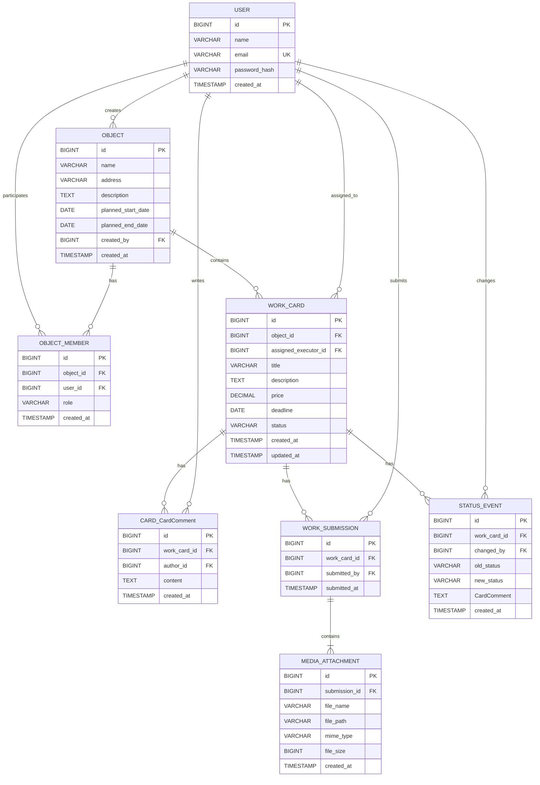
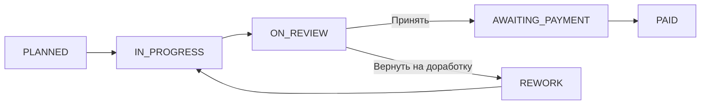

# 03 — Data Model

Документ содержит модель данных, ER-связи, словарь полей, ограничения, финансовые формулы и требования к сохранению результатов.

### 4.4. Построить модель данных

Словарь данных

1. User

| Поле | Тип БД | Nullable | Default | Уникальность / FK | Ограничения | Пример | Бизнес-правило | Требование |
| --- | --- | --- | --- | --- | --- | --- | --- | --- |
| User.id | BIGINT | NOT NULL | auto-generated | PK | Положительный идентификатор | 1 | Уникально идентифицирует пользователя | SYS-001 |
| User.name | VARCHAR(100) | NOT NULL | — | — | Длина от 1 до 100 символов | Иван Иванов | Имя пользователя обязательно | SYS-001 |
| User.email | VARCHAR(255) | NOT NULL | — | UNIQUE | Корректный формат email | ivan@example.com | Используется как уникальная учётная запись | SYS-001 |
| User.password_hash | VARCHAR(255) | NOT NULL | — | — | Хранится только хеш пароля | $2a$10$... | Пароль не хранится в открытом виде | NFR-003 |
| User.created_at | TIMESTAMP | NOT NULL | CURRENT_TIMESTAMP | — | — | 2026-08-20 12:00:00 | Фиксируется дата создания учётной записи | NFR-001 |

2. Object

| Поле | Тип БД | Nullable | Default | Уникальность / FK | Ограничения | Пример | Бизнес-правило | Требование |
| --- | --- | --- | --- | --- | --- | --- | --- | --- |
| Object.id | BIGINT | NOT NULL | auto-generated | PK | Положительный идентификатор | 1 | Уникально идентифицирует объект | OBJ-001 |
| Object.name | VARCHAR(200) | NOT NULL | — | — | Длина от 1 до 200 символов | Ремонт квартиры | Название объекта обязательно | OBJ-001 |
| Object.address | VARCHAR(500) | NOT NULL | — | — | Длина до 500 символов | г. Москва, ул. Ленина, 10 | Адрес объекта обязателен | OBJ-001 |
| Object.description | TEXT | NOT NULL | — | — | Не пустое значение | Капитальный ремонт квартиры | Описание объекта обязательно | OBJ-001 |
| Object.planned_start_date | DATE | NOT NULL | — | — | Дата начала не позже даты окончания | 2026-09-01 | Определяет плановую дату начала | OBJ-001 |
| Object.planned_end_date | DATE | NOT NULL | — | — | planned_end_date >= planned_start_date | 2026-12-01 | Определяет плановую дату окончания | OBJ-001 |
| Object.created_by | BIGINT | NOT NULL | — | FK → User.id | Создатель должен существовать | 1 | Объект создаётся заказчиком | OBJ-001 |
| Object.created_at | TIMESTAMP | NOT NULL | CURRENT_TIMESTAMP | — | — | 2026-08-20 12:00:00 | Фиксируется дата создания объекта | OBJ-001 |

3. ObjectMember

| Поле | Тип БД | Nullable | Default | Уникальность / FK | Ограничения | Пример | Бизнес-правило | Требование |
| --- | --- | --- | --- | --- | --- | --- | --- | --- |
| ObjectMember.id | BIGINT | NOT NULL | auto-generated | PK | Положительный идентификатор | 1 | Уникально идентифицирует участие | OBJ-002 |
| ObjectMember.object_id | BIGINT | NOT NULL | — | FK → Object.id | Объект должен существовать | 1 | Пользователь добавляется в конкретный объект | OBJ-002 |
| ObjectMember.user_id | BIGINT | NOT NULL | — | FK → User.id | UNIQUE(object_id, user_id) | 2 | Пользователь может быть участником объекта только один раз | OBJ-002 |
| ObjectMember.role | VARCHAR(20) | NOT NULL | — | — | CHECK (role IN ('CUSTOMER', 'EXECUTOR')) | EXECUTOR | Роль определяется отдельно для каждого объекта | OBJ-003 |
| ObjectMember.created_at | TIMESTAMP | NOT NULL | CURRENT_TIMESTAMP | — | — | 2026-08-20 12:00:00 | Фиксируется дата добавления участника | OBJ-002 |

4. WorkCard

| Поле | Тип БД | Nullable | Default | Уникальность / FK | Ограничения | Пример | Бизнес-правило | Требование |
| --- | --- | --- | --- | --- | --- | --- | --- | --- |
| WorkCard.id | BIGINT | NOT NULL | auto-generated | PK | Положительный идентификатор | 1 | Уникально идентифицирует карточку работы | WORK-001 |
| WorkCard.object_id | BIGINT | NOT NULL | — | FK → Object.id | Объект должен существовать | 1 | Карточка принадлежит одному объекту | WORK-001 |
| WorkCard.assigned_executor_id | BIGINT | NOT NULL | — | FK → User.id | Пользователь должен быть исполнителем данного объекта | 2 | Автор карточки является её исполнителем | WORK-004 |
| WorkCard.title | VARCHAR(200) | NOT NULL | — | — | Длина от 1 до 200 символов | Покраска стен | Изменение запрещено после перехода в  IN_PROGRESS | WORK-003 |
| WorkCard.description | TEXT | NOT NULL | — | — | Не пустое значение | Покрасить стены в комнате | Изменение запрещено после перехода в  IN_PROGRESS | WORK-003 |
| WorkCard.price | DECIMAL(12,2) | NOT NULL | — | — | CHECK (price >= 0) | 85000.00 | Изменение запрещено после перехода в  IN_PROGRESS | BR-WORK-07 |
| WorkCard.deadline | DATE | NOT NULL | — | — | Корректная дата | 2026-09-15 | Изменение запрещено после перехода в  IN_PROGRESS | WORK-003 |
| WorkCard.status | VARCHAR(30) | NOT NULL | PLANNED | — | CHECK  на допустимые статусы | PLANNED | Изменяется только по разрешённым переходам | STATUS-001 |
| WorkCard.created_at | TIMESTAMP | NOT NULL | CURRENT_TIMESTAMP | — | — | 2026-08-20 12:00:00 | Фиксируется дата создания карточки | WORK-001 |
| WorkCard.updated_at | TIMESTAMP | NOT NULL | CURRENT_TIMESTAMP | — | Обновляется при изменении карточки | 2026-08-20 14:00:00 | Отражает последнее изменение | WORK-002 |

5. CardComment

| Поле | Тип БД | Nullable | Default | Уникальность / FK | Ограничения | Пример | Бизнес-правило | Требование |
| --- | --- | --- | --- | --- | --- | --- | --- | --- |
| CardComment.id | BIGINT | NOT NULL | auto-generated | PK | Положительный идентификатор | 1 | Уникально идентифицирует комментарий | CardComment-001 |
| CardComment.work_item_id | BIGINT | NOT NULL | — | FK → WorkCard.id | Карточка должна существовать | 1 | Комментарий относится к конкретной карточке | CardComment-001 |
| CardComment.author_id | BIGINT | NOT NULL | — | FK → User.id | Автор должен быть участником объекта | 2 | Комментарии могут писать участники объекта | CardComment-001 |
| CardComment.content | TEXT | NOT NULL | — | — | Не пустое значение | Необходимо исправить неровности | Обязателен как причина возврата на доработку | CardComment-002 |
| CardComment.created_at | TIMESTAMP | NOT NULL | CURRENT_TIMESTAMP | — | — | 2026-08-20 15:00:00 | Фиксируется дата создания комментария | CardComment-001 |

6. WorkSubmission

Каждая новая отправка результата создаёт отдельную запись. Предыдущие подачи не изменяются и не перезаписываются.

| Поле | Тип БД | Nullable | Default | Уникальность / FK | Ограничения | Пример | Бизнес-правило | Требование |
| --- | --- | --- | --- | --- | --- | --- | --- | --- |
| WorkSubmission.id | BIGINT | NOT NULL | auto-generated | PK | Положительный идентификатор | 1 | Уникально идентифицирует подачу результата | STATUS-002 |
| WorkSubmission.work_item_id | BIGINT | NOT NULL | — | FK → WorkCard.id | Карточка должна существовать | 1 | Одна карточка может иметь несколько подач | STATUS-002 |
| WorkSubmission.submitted_by | BIGINT | NOT NULL | — | FK → User.id | Должен быть назначенным исполнителем | 2 | Результат отправляет исполнитель карточки | STATUS-002 |
| WorkSubmission.submitted_at | TIMESTAMP | NOT NULL | CURRENT_TIMESTAMP | — | — | 2026-08-20 15:00:00 | Фиксируется время подачи результата | STATUS-002 |

7. MediaAttachment

| Поле | Тип БД | Nullable | Default | Уникальность / FK | Ограничения | Пример | Бизнес-правило | Требование |
| --- | --- | --- | --- | --- | --- | --- | --- | --- |
| MediaAttachment.id | BIGINT | NOT NULL | auto-generated | PK | Положительный идентификатор | 1 | Уникально идентифицирует файл | MEDIA-001 |
| MediaAttachment.submission_id | BIGINT | NOT NULL | — | FK → WorkSubmission.id | Подача должна существовать | 1 | Файл относится к конкретной подаче | MEDIA-001 |
| MediaAttachment.file_name | VARCHAR(255) | NOT NULL | — | — | Допустимое имя файла | result.jpg | Хранит исходное имя файла | MEDIA-001 |
| MediaAttachment.file_path | VARCHAR(500) | NOT NULL | — | UNIQUE | Путь внутри  ./uploads | ./uploads/1/result.jpg | Физический файл хранится локально | MEDIA-003 |
| MediaAttachment.mime_type | VARCHAR(100) | NOT NULL | — | — | image/jpeg ,  image/png ,  image/webp | image/jpeg | Разрешены только поддерживаемые форматы | MEDIA-002 |
| MediaAttachment.file_size | BIGINT | NOT NULL | — | — | CHECK (file_size > 0 AND file_size <= 10485760) | 2048576 | Размер файла не более 10 MB | MEDIA-001 |
| MediaAttachment.created_at | TIMESTAMP | NOT NULL | CURRENT_TIMESTAMP | — | — | 2026-08-20 15:00:00 | Фиксируется время загрузки файла | MEDIA-001 |

8. StatusEvent

| Поле | Тип БД | Nullable | Default | Уникальность / FK | Ограничения | Пример | Бизнес-правило | Требование |
| --- | --- | --- | --- | --- | --- | --- | --- | --- |
| StatusEvent.id | BIGINT | NOT NULL | auto-generated | PK | Положительный идентификатор | 1 | Уникально идентифицирует запись истории | HISTORY-001 |
| StatusEvent.work_item_id | BIGINT | NOT NULL | — | FK → WorkCard.id | Карточка должна существовать | 1 | История относится к конкретной карточке | HISTORY-001 |
| StatusEvent.changed_by | BIGINT | NOT NULL | — | FK → User.id | Пользователь должен иметь право на переход | 2 | Фиксируется пользователь, изменивший статус | HISTORY-001 |
| StatusEvent.old_status | VARCHAR(30) | NOT NULL | — | — | Допустимый предыдущий статус | PLANNED | Фиксируется исходный статус | HISTORY-001 |
| StatusEvent.new_status | VARCHAR(30) | NOT NULL | — | — | Допустимый новый статус | IN_PROGRESS | Фиксируется новый статус | HISTORY-001 |
| StatusEvent.CardComment | TEXT | NULL | NULL | — | Обязателен при  new_status = REWORK | Исправить неровности | При возврате на доработку требуется причина | STATUS-005 |
| StatusEvent.created_at | TIMESTAMP | NOT NULL | CURRENT_TIMESTAMP | — | — | 2026-08-20 15:30:00 | Фиксируется дата и время изменения статуса | HISTORY-001 |

✅ 4.5

### 4.5. Описать роли и доступы

Для системы используется RBAC-модель, в которой права пользователя определяются его ролью в конкретном объекте. Проверка доступа выполняется на backend.

| Действие | Заказчик ( CUSTOMER ) | Исполнитель ( EXECUTOR ) | Дополнительное условие |
| --- | --- | --- | --- |
| Создать объект | Да | Нет | Создатель автоматически становится  CUSTOMER |
| Просмотреть объект | Да | Да | Пользователь должен состоять в объекте |
| Добавить исполнителя | Да | Нет | Только из готовых учётных записей |
| Просмотреть участников | Да | Да | Пользователь должен состоять в объекте |
| Создать карточку | Нет | Да | Исполнитель состоит в объекте; автор автоматически назначается исполнителем |
| Просмотреть карточки | Да | Да | Карточки доступны только в объектах, где пользователь является участником |
| Редактировать свою карточку | Нет | Да | Только назначенный исполнитель и только в статусе  PLANNED |
| Редактировать чужую карточку | Нет | Нет | Запрещено |
| Начать работу | Нет | Да | Только назначенный исполнитель;  PLANNED → IN_PROGRESS |
| Загрузить фотографии результата | Нет | Да | Только назначенный исполнитель |
| Отправить работу на проверку | Нет | Да | Только назначенный исполнитель; статус  IN_PROGRESS ; минимум 1 фотография |
| Просмотреть результаты работы | Да | Да | Пользователь должен состоять в объекте |
| Написать комментарий | Да | Да | Пользователь должен состоять в объекте |
| Принять работу | Да | Нет | Только из статуса  ON_REVIEW |
| Вернуть на доработку | Да | Нет | Только из  ON_REVIEW ; комментарий с причиной обязателен |
| Возобновить работу после доработки | Нет | Да | Только назначенный исполнитель;  REWORK → IN_PROGRESS |
| Отметить оплату | Да | Нет | Только из статуса  AWAITING_PAYMENT |
| Просмотреть историю статусов | Да | Да | Пользователь должен состоять в объекте |

Правило проверки доступа

Backend должен проверять доступ в следующем порядке:

Пользователь авторизован.

Пользователь является участником объекта.

Определяется его роль в объекте: CUSTOMER или EXECUTOR.

Проверяется дополнительное условие: например, является ли исполнитель назначенным для конкретной карточки.

Проверяется текущий статус карточки и допустимость выполняемого действия.

Frontend может скрывать недоступные кнопки для удобства пользователя, но это не является механизмом защиты. Окончательная проверка прав и бизнес-ограничений выполняется только на backend.

✅ 4.6

### 4.6. Зафиксировать машину статусов

### 4.6.1. Основная ветка — успешное прохождение работы

Основная ветка описывает сценарий, при котором заказчик принимает результат работы и карточка последовательно проходит до оплаты.

| Из статуса | В статус | Кто может выполнить | Предусловия | Обязательные данные | Побочные эффекты | Код ошибки |
| --- | --- | --- | --- | --- | --- | --- |
| PLANNED | IN_PROGRESS | EXECUTOR | Пользователь является назначенным исполнителем ( assignee ) | — | Фиксируется изменение статуса в  WorkItemStatusHistory ; поля карточки  title ,  description ,  price ,  deadline  становятся недоступными для изменения | 403 Forbidden  — не  assignee ;  409 Conflict  — неверный текущий статус |
| IN_PROGRESS | ON_REVIEW | EXECUTOR | Пользователь является  assignee ; работа находится в  IN_PROGRESS | От 1 до 10  новых  фотографий | Создаётся новый  WorkSubmission ; создаются  MediaAttachment ; фиксируется история статуса | 400 Bad Request  — нет фото или неверное количество/формат;  403 Forbidden  — не  assignee ;  409 Conflict  — неверный статус |
| ON_REVIEW | AWAITING_PAYMENT | CUSTOMER | Работа принята заказчиком | — | Создаётся запись в  WorkItemStatusHistory ; стоимость работы начинает учитываться в сумме ожидающей оплаты | 403 Forbidden  — нет прав;  409 Conflict  — неверный статус |
| AWAITING_PAYMENT | PAID | CUSTOMER | Личный перевод исполнителю выполнен | Подтверждение действия заказчиком | Создаётся запись в  WorkItemStatusHistory ; стоимость работы учитывается как оплаченная | 403 Forbidden  — нет прав;  409 Conflict  — неверный статус |

Итоговая последовательность основной ветки:

PLANNED → IN_PROGRESS → ON_REVIEW → AWAITING_PAYMENT → PAID

### 4.6.2. Ветка возврата

Ветка REWORK является альтернативной веткой, которая возникает только в случае, если заказчик не принимает результат работы после перехода карточки в ON_REVIEW.

| Из статуса | В статус | Кто может выполнить | Предусловия | Обязательные данные | Побочные эффекты | Код ошибки |
| --- | --- | --- | --- | --- | --- | --- |
| ON_REVIEW | REWORK | CUSTOMER | Пользователь является заказчиком объекта | Обязательный  comment  с причиной доработки | Комментарий сохраняется в БД; создаётся запись в  WorkItemStatusHistory | 400 Bad Request  — комментарий отсутствует;  403 Forbidden  — нет прав;  409 Conflict  — неверный статус |
| REWORK | IN_PROGRESS | EXECUTOR | Пользователь является назначенным исполнителем ( assignee ) | — | Создаётся запись в  WorkItemStatusHistory ; исполнитель продолжает работу над новой подачей результата | 403 Forbidden  — не  assignee ;  409 Conflict  — неверный статус |

Итоговая последовательность ветки возврата:

ON_REVIEW → REWORK → IN_PROGRESS → ON_REVIEW

После повторного перехода в ON_REVIEW заказчик снова выбирает одну из двух возможностей:

принять результат → AWAITING_PAYMENT;

вернуть на доработку → REWORK.

То есть ON_REVIEW — это точка принятия решения, а не промежуточный статус, который автоматически ведёт в REWORK.

✅ 4.7

### 4.7. Описать финансовые формулы

Финансовые показатели рассчитываются автоматически на основе стоимости карточек работ (WorkCard.price) внутри конкретного объекта ремонта.

Основные формулы

Object.total_cost = SUM(WorkCard.price)

Object.awaiting_payment = SUM(WorkCard.price WHERE status = AWAITING_PAYMENT)

Object.paid = SUM(WorkCard.price WHERE status = PAID)

Правила расчёта

| Показатель | Формула | Правило |
| --- | --- | --- |
| Object.total_cost | SUM(price) | Сумма стоимости всех карточек работ объекта |
| Object.awaiting_payment | SUM(price WHERE status = AWAITING_PAYMENT) | Сумма принятых, но ещё не оплаченных работ |
| Object.paid | SUM(price WHERE status = PAID) | Сумма оплаченных работ |

Правила хранения и округления

Валюта системы — российский рубль (RUB).

Стоимость работы хранится в поле WorkItem.price типа DECIMAL(12,2).

Все расчёты выполняются с точностью до 2 знаков после запятой.

Округление выполняется по стандартному математическому правилу до двух знаков после запятой.

Денежные значения не хранятся в типах FLOAT или DOUBLE.

Если в объекте отсутствуют карточки работ, результат SUM принимается равным 0.00, а не NULL.

Учёт статусов

| Статус работы | Учитывается в  total_cost | Учитывается в  awaiting_payment | Учитывается в  paid |
| --- | --- | --- | --- |
| PLANNED | Да | Нет | Нет |
| IN_PROGRESS | Да | Нет | Нет |
| ON_REVIEW | Да | Нет | Нет |
| REWORK | Да | Нет | Нет |
| AWAITING_PAYMENT | Да | Да | Нет |
| PAID | Да | Нет | Да |

Архивные данные

В рамках MVP отдельный статус или механизм архивирования объектов и карточек работ не предусмотрен.

Поэтому все существующие карточки WorkCard участвуют в расчёте Object.total_cost, независимо от текущего статуса. Исключение возможно только при физическом удалении карточки, если такое действие будет предусмотрено требованиями.

Если архивирование будет добавлено после MVP, архивные карточки должны быть исключены из текущих финансовых показателей по умолчанию, либо правила их учёта должны быть отдельно зафиксированы бизнес-требованием.

✅ 4.8