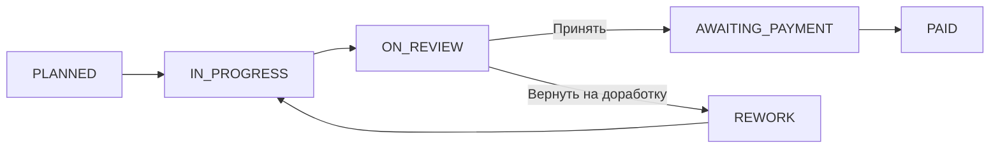

# 04 — RBAC and Statuses

Документ содержит RBAC, порядок проверки доступа, основной FSM, ветку REWORK, условия переходов и ошибки.

### 4.5. Описать роли и доступы

Для системы используется RBAC-модель, в которой права пользователя определяются его ролью в конкретном объекте. Проверка доступа выполняется на backend.

| Действие | Заказчик ( CUSTOMER ) | Исполнитель ( EXECUTOR ) | Дополнительное условие |
| --- | --- | --- | --- |
| Создать объект | Да | Нет | Создатель автоматически становится  CUSTOMER |
| Просмотреть объект | Да | Да | Пользователь должен состоять в объекте |
| Добавить исполнителя | Да | Нет | Только из готовых учётных записей |
| Просмотреть участников | Да | Да | Пользователь должен состоять в объекте |
| Создать карточку | Нет | Да | Исполнитель состоит в объекте; автор автоматически назначается исполнителем |
| Просмотреть карточки | Да | Да | Карточки доступны только в объектах, где пользователь является участником |
| Редактировать свою карточку | Нет | Да | Только назначенный исполнитель и только в статусе  PLANNED |
| Редактировать чужую карточку | Нет | Нет | Запрещено |
| Начать работу | Нет | Да | Только назначенный исполнитель;  PLANNED → IN_PROGRESS |
| Загрузить фотографии результата | Нет | Да | Только назначенный исполнитель |
| Отправить работу на проверку | Нет | Да | Только назначенный исполнитель; статус  IN_PROGRESS ; минимум 1 фотография |
| Просмотреть результаты работы | Да | Да | Пользователь должен состоять в объекте |
| Написать комментарий | Да | Да | Пользователь должен состоять в объекте |
| Принять работу | Да | Нет | Только из статуса  ON_REVIEW |
| Вернуть на доработку | Да | Нет | Только из  ON_REVIEW ; комментарий с причиной обязателен |
| Возобновить работу после доработки | Нет | Да | Только назначенный исполнитель;  REWORK → IN_PROGRESS |
| Отметить оплату | Да | Нет | Только из статуса  AWAITING_PAYMENT |
| Просмотреть историю статусов | Да | Да | Пользователь должен состоять в объекте |

Правило проверки доступа

Backend должен проверять доступ в следующем порядке:

Пользователь авторизован.

Пользователь является участником объекта.

Определяется его роль в объекте: CUSTOMER или EXECUTOR.

Проверяется дополнительное условие: например, является ли исполнитель назначенным для конкретной карточки.

Проверяется текущий статус карточки и допустимость выполняемого действия.

Frontend может скрывать недоступные кнопки для удобства пользователя, но это не является механизмом защиты. Окончательная проверка прав и бизнес-ограничений выполняется только на backend.

✅ 4.6

### 4.6. Зафиксировать машину статусов

### 4.6.1. Основная ветка — успешное прохождение работы

Основная ветка описывает сценарий, при котором заказчик принимает результат работы и карточка последовательно проходит до оплаты.

| Из статуса | В статус | Кто может выполнить | Предусловия | Обязательные данные | Побочные эффекты | Код ошибки |
| --- | --- | --- | --- | --- | --- | --- |
| PLANNED | IN_PROGRESS | EXECUTOR | Пользователь является назначенным исполнителем ( assignee ) | — | Фиксируется изменение статуса в  WorkItemStatusHistory ; поля карточки  title ,  description ,  price ,  deadline  становятся недоступными для изменения | 403 Forbidden  — не  assignee ;  409 Conflict  — неверный текущий статус |
| IN_PROGRESS | ON_REVIEW | EXECUTOR | Пользователь является  assignee ; работа находится в  IN_PROGRESS | От 1 до 10  новых  фотографий | Создаётся новый  WorkSubmission ; создаются  MediaAttachment ; фиксируется история статуса | 400 Bad Request  — нет фото или неверное количество/формат;  403 Forbidden  — не  assignee ;  409 Conflict  — неверный статус |
| ON_REVIEW | AWAITING_PAYMENT | CUSTOMER | Работа принята заказчиком | — | Создаётся запись в  WorkItemStatusHistory ; стоимость работы начинает учитываться в сумме ожидающей оплаты | 403 Forbidden  — нет прав;  409 Conflict  — неверный статус |
| AWAITING_PAYMENT | PAID | CUSTOMER | Личный перевод исполнителю выполнен | Подтверждение действия заказчиком | Создаётся запись в  WorkItemStatusHistory ; стоимость работы учитывается как оплаченная | 403 Forbidden  — нет прав;  409 Conflict  — неверный статус |

Итоговая последовательность основной ветки:

PLANNED → IN_PROGRESS → ON_REVIEW → AWAITING_PAYMENT → PAID

### 4.6.2. Ветка возврата

Ветка REWORK является альтернативной веткой, которая возникает только в случае, если заказчик не принимает результат работы после перехода карточки в ON_REVIEW.

| Из статуса | В статус | Кто может выполнить | Предусловия | Обязательные данные | Побочные эффекты | Код ошибки |
| --- | --- | --- | --- | --- | --- | --- |
| ON_REVIEW | REWORK | CUSTOMER | Пользователь является заказчиком объекта | Обязательный  comment  с причиной доработки | Комментарий сохраняется в БД; создаётся запись в  WorkItemStatusHistory | 400 Bad Request  — комментарий отсутствует;  403 Forbidden  — нет прав;  409 Conflict  — неверный статус |
| REWORK | IN_PROGRESS | EXECUTOR | Пользователь является назначенным исполнителем ( assignee ) | — | Создаётся запись в  WorkItemStatusHistory ; исполнитель продолжает работу над новой подачей результата | 403 Forbidden  — не  assignee ;  409 Conflict  — неверный статус |

Итоговая последовательность ветки возврата:

ON_REVIEW → REWORK → IN_PROGRESS → ON_REVIEW

После повторного перехода в ON_REVIEW заказчик снова выбирает одну из двух возможностей:

принять результат → AWAITING_PAYMENT;

вернуть на доработку → REWORK.

То есть ON_REVIEW — это точка принятия решения, а не промежуточный статус, который автоматически ведёт в REWORK.

✅ 4.7